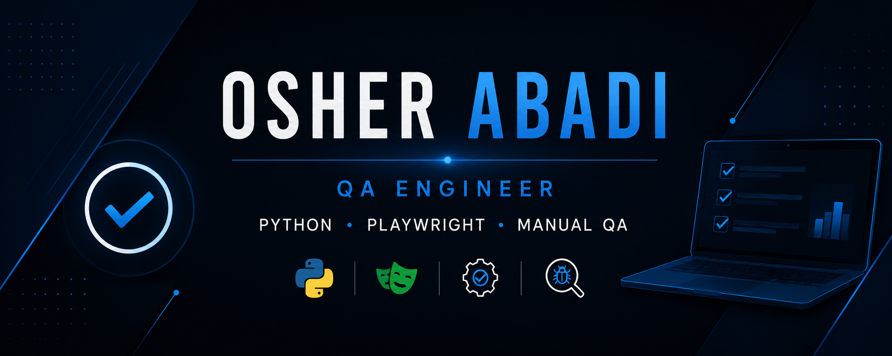

  

# Hi, I'm Osher Abadi 👋

### QA Engineer | Manual QA | Test Automation

**Currently looking for QA & Test Automation opportunities**

Focused on software quality • Python • Playwright • Automation

 

---

# 👨‍💻 About Me

QA Engineer with experience in Manual QA for Web and Mobile applications.

Passionate about software quality, bug investigation, and continuously improving my automation skills with Python and Playwright.

---

# 🚀 Featured Projects

## 📱 Mobile QA Testing Project

Manual QA project for the **Israir Mobile Application**.

- Test Planning
- Test Cases
- Test Execution
- Bug Reports
- Usability Testing

🔗 **Repository:** *(Coming Soon)*

---

## 🌐 Web QA Testing Project

Manual QA project for a web application.

- Functional Testing
- Regression Testing
- Exploratory Testing
- Jira
- TestRail

🔗 **Repository:** *(Coming Soon)*

---

## 🤖 Python Automation Project

Automation framework built with:

- Python
- Playwright
- Pytest
- Page Object Model (POM)

🔗 **Repository:** *(Coming Soon)*

---

# 🛠 Tech Stack

### Manual QA

- Functional Testing
- Regression Testing
- Exploratory Testing
- Web & Mobile Testing
- API Testing (Postman)
- SQL Basics
- Jira
- TestRail
- Figma
- Chrome DevTools

### Automation

- Python
- Playwright
- Pytest
- Page Object Model
- Object-Oriented Programming (OOP)

### Development

- Git
- GitHub
- VS Code
- PyCharm

---

# 🏆 Certifications

- QA Automation Course
- Manual QA Course

---

# 📫 Connect With Me

